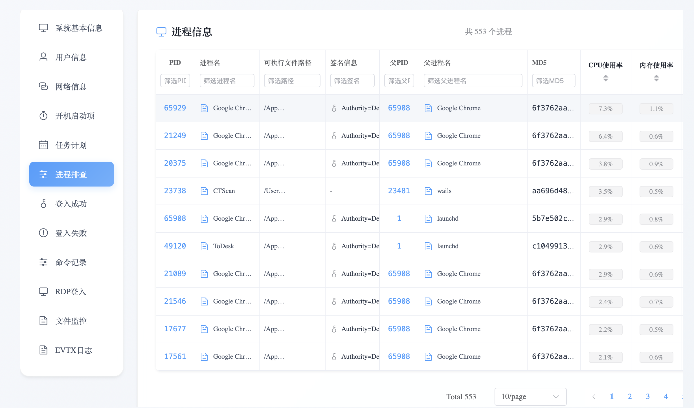

## CTScan 应用介绍
又一款应急响应工具，用于快速排查系统问题，快速排查磁盘问题，快速排查内存等异常问题，特点如下

- 基于wails 框架开发
- 跨平台（MAC 兼容更优）
- 更好看的UI
- 更少的系统原生命令调用，预防命令被替换风险
- windows evtx 文件解析
- 所有信息持久化sqlite数据库保存到本地，默认保存在桌面 

## 应用部分使用截图





## 二次开发教程
1、wails开发环境准备
```
Go 1.21+ (macOS 15+ requires Go 1.23.3+)
NPM (Node 15+)
参考：https://wails.io/docs/gettingstarted/installation
```

2、前端开发在如下文件夹下添加组件

```
ctscan_gui/frontend/src/components
```
3、后端开发在如下文件夹下添加组件功能
```
ctscan_gui/pkg
```
4、开发与编译
```shell
## 开发环境
go mod tidy
wails dev 
##编译后默认路径ctscan_gui/build/bin
wails build 
```